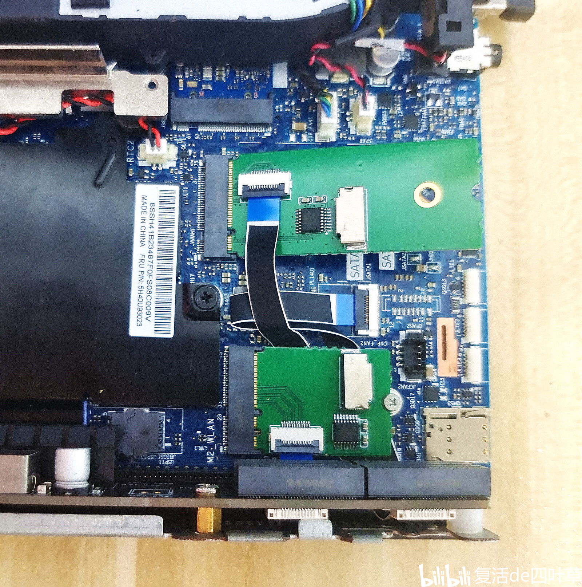
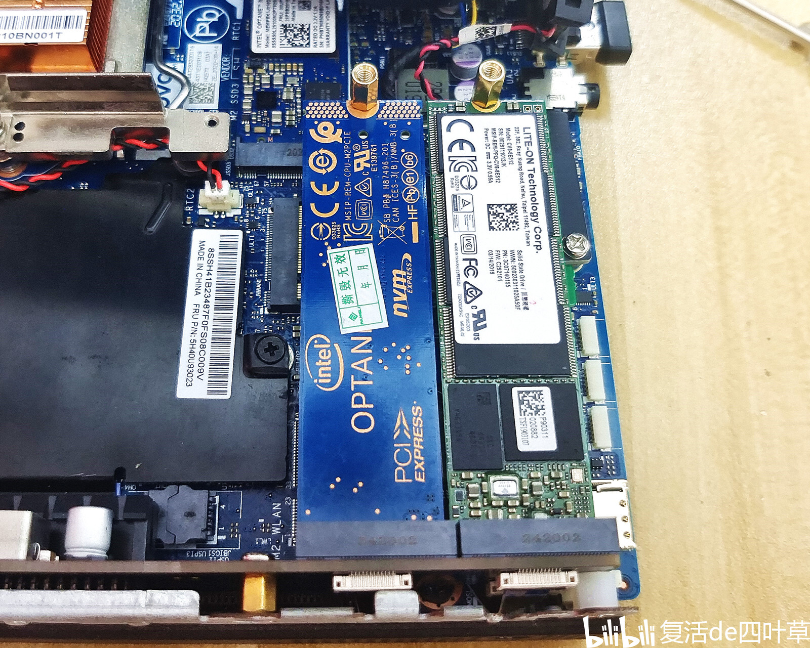
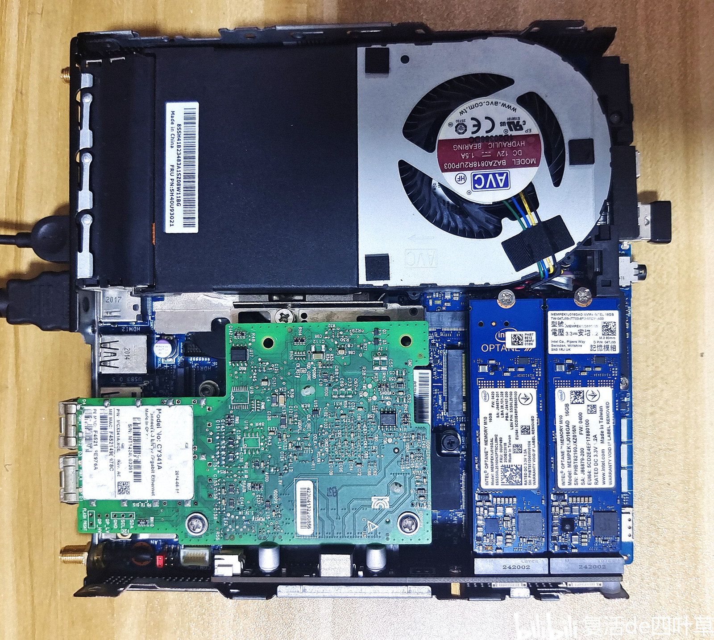
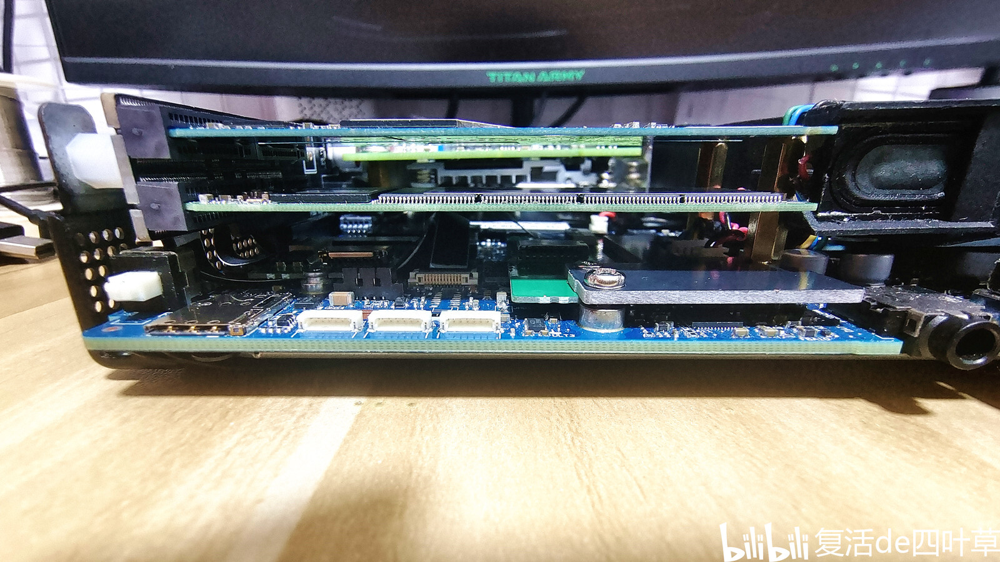

# P350Tiny-riser-card

Lenovo P350 Tiny7 PCIE Card

***\* It has been tested and is now available for sale on Taobao. \****

中文文档: [README_CN.md](README_CN.md)

Purchase Address:

https://h5.m.taobao.com/awp/core/detail.htm?id=970676572487

If you are an overseas user, you cannot purchase directly on Taobao. Instead, you can use a third-party purchasing platform.

https://www.superbuy.com/

For other tutorial information, please refer to the link on Bilibili:  https://b23.tv/Vhjv9B8

## PCIE Split Card Picture

Introduction to Split Card Interface Resources, Supported: 

    1* PCIE slot ( x8 )

    1* M.2 slot (nvme PCIE3.0 x4)

    1* M.2 slot ( It needs to be connected to the WLAN interface.  PCIE3.0 x1)

    1* M.2 slot ( It needs to be connected to the WWAN interface. PCIE3.0 x1)

    1* M.2 slot ( It needs to be connected to the SATA interface. NGFF SATA)

    1* FAN slot (12V XH2.54)

Introduction to Expanded Card Interface Resources

All accessories of the expansion card

## detail picture

Installation of WWAN and WLAN adapter cards

Two hard drives are installed on the lower layer. ** Note: The one on the left is an NVME protocol PCIE3.0x4, and the one on the right is a NGFF SATA protocol hard drive. **

The two hard drives on the upper layer

After installation, the overall effect is...

Observe the hard disk from the side. The distance between the upper and lower layers is 7mm.

