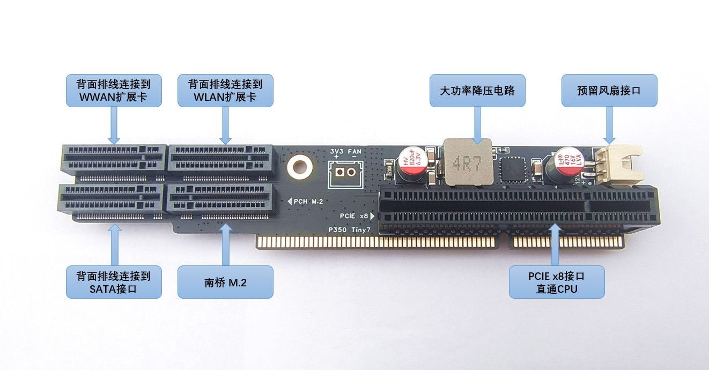
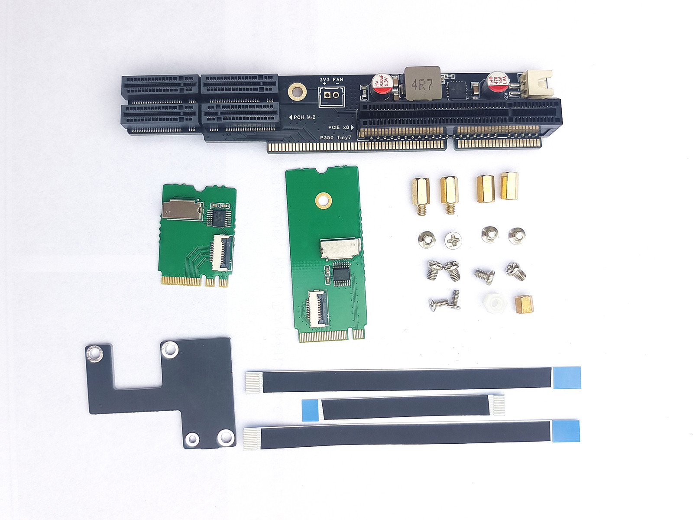
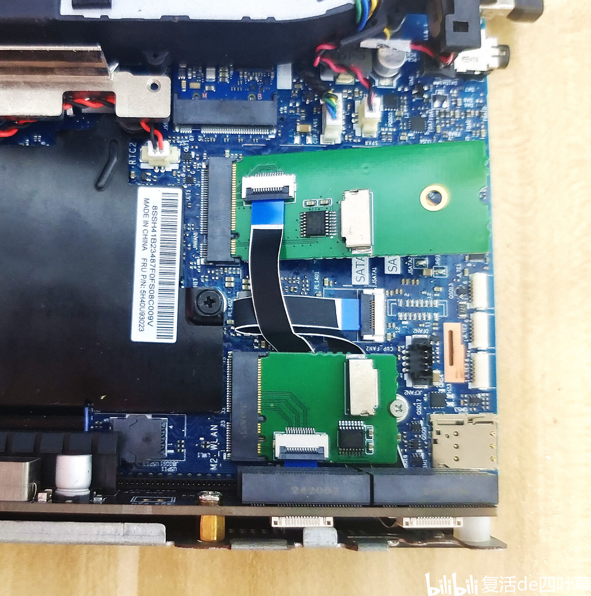
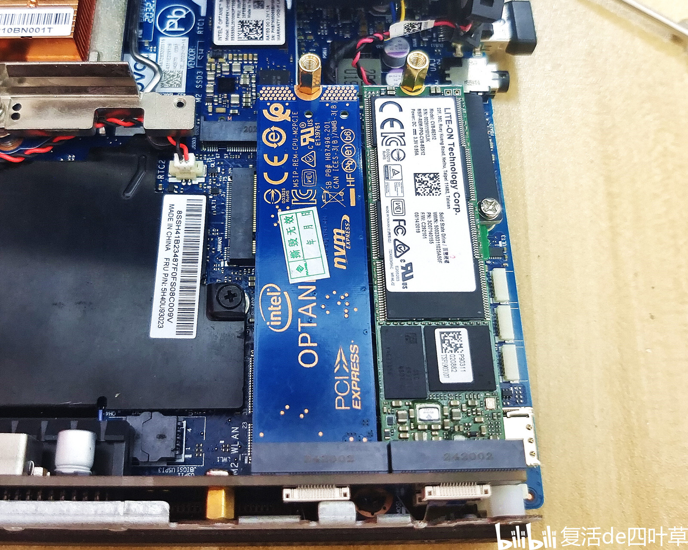
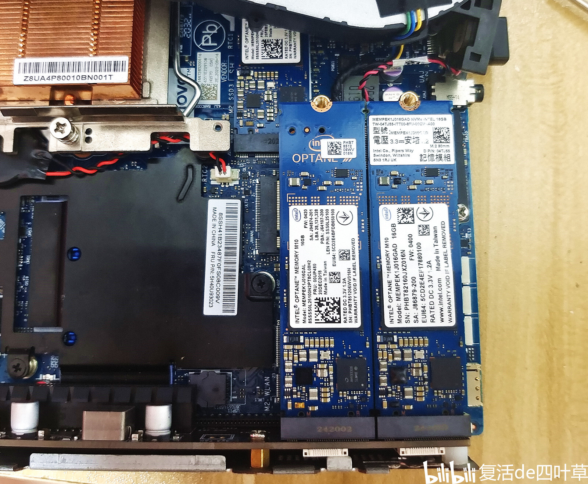
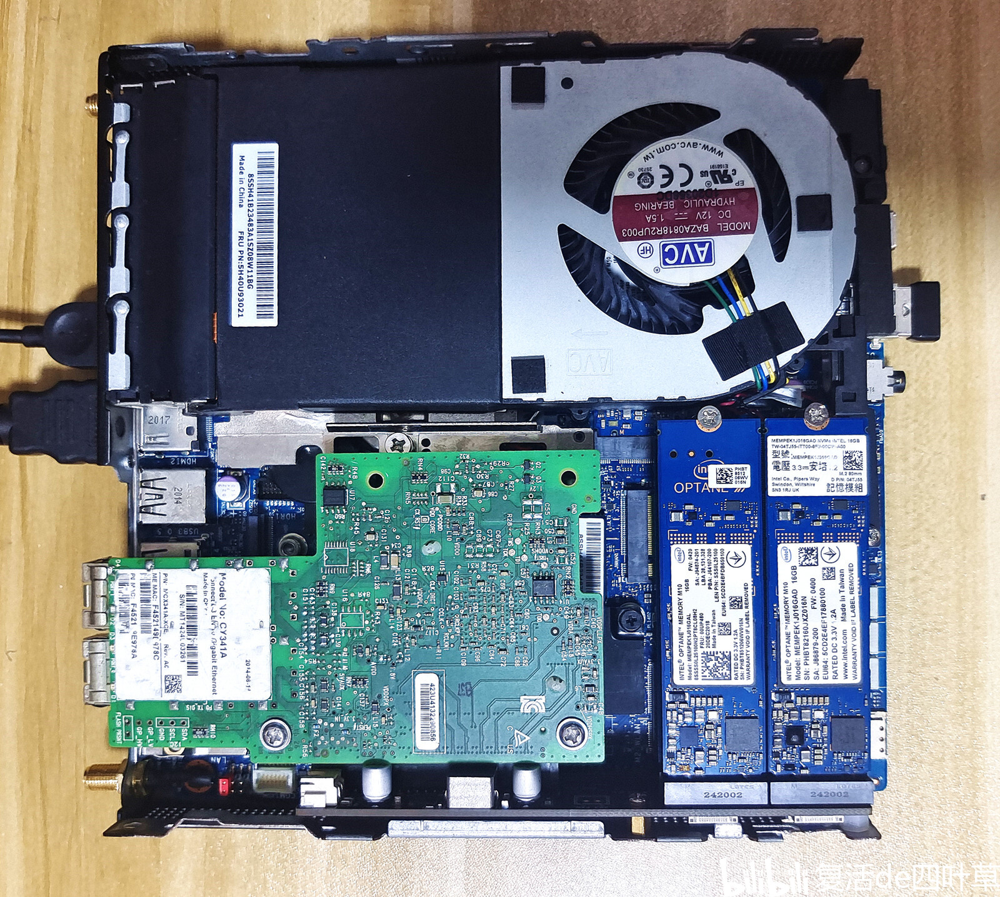
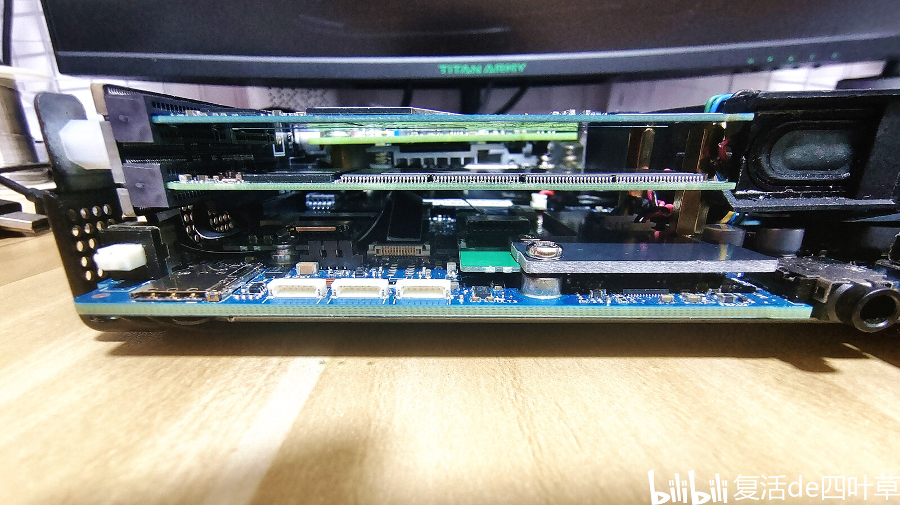

# P350Tiny-riser-card

Lenovo P350 Tiny7 PCIE Card

***\* 目前已经测试完成，已在淘宝销售 \****

English explanatory document: [README.md](README.md)

购买地址

https://h5.m.taobao.com/awp/core/detail.htm?id=970676572487

如果是海外用户，无法直接在淘宝购买，可以使用代购平台：

https://www.superbuy.com/

其他教程信息请看B站链接： https://b23.tv/Vhjv9B8

## PCIE拆分卡图片

拆分卡接口资源介绍，支持： 

    1个PCIE插槽( x8 )

    1个M.2插槽(nvme PCIE3.0 x4)

    1个M.2插槽( 需连接至WLAN接口， PCIE3.0 x1)

    1个M.2插槽( 需连接至WWAN接口， PCIE3.0 x1)

    1个M.2插槽( 需连接至SATA接口， NGFF SATA)

    1个风扇插座(12V XH2.54)

扩展卡接口资源介绍

扩展卡全部配件

## 细节图片

WWAN和WLAN转接卡安装

下层2个硬盘安装。 ** 注意：左侧的是NVME协议PCIE3.0x4, 右侧的是NGFF SATA协议硬盘 **

上层的2个硬盘

安装完毕，整体的效果

侧面观察硬盘，上下层间距7mm

